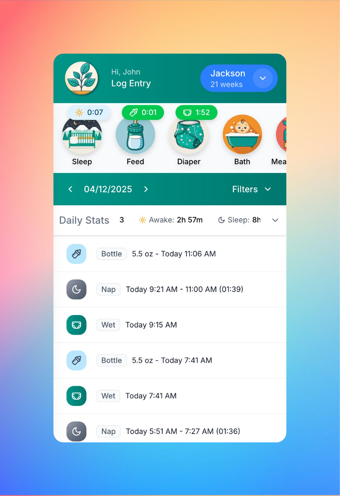
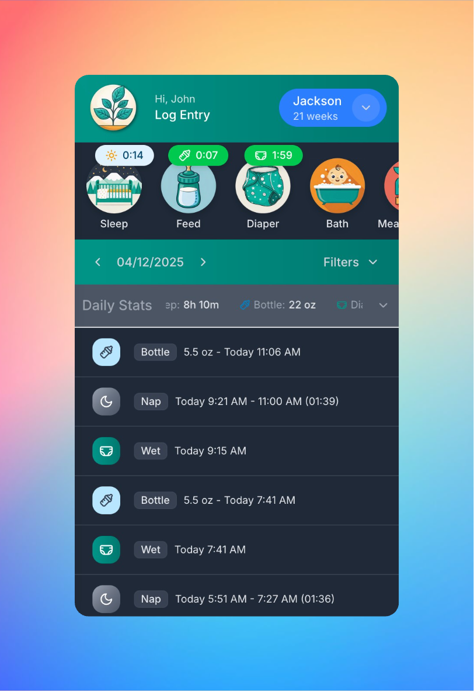
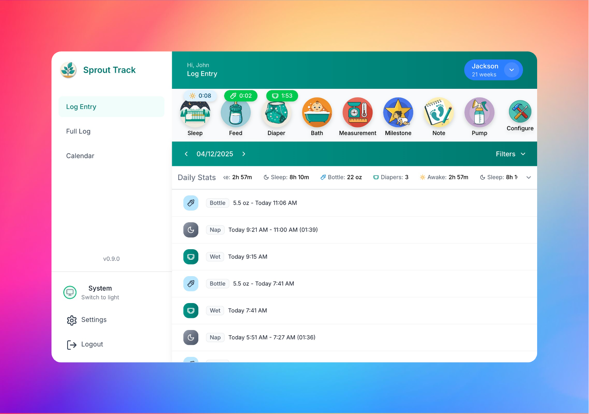
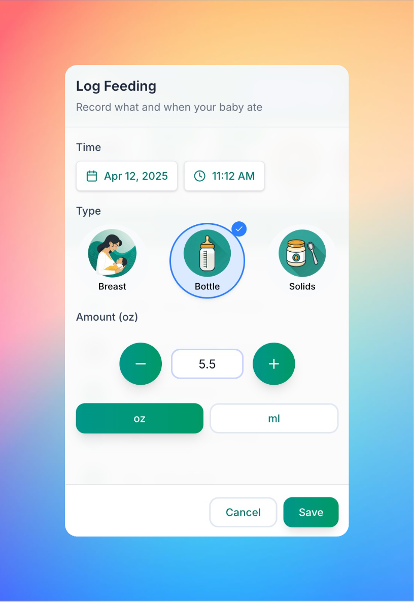
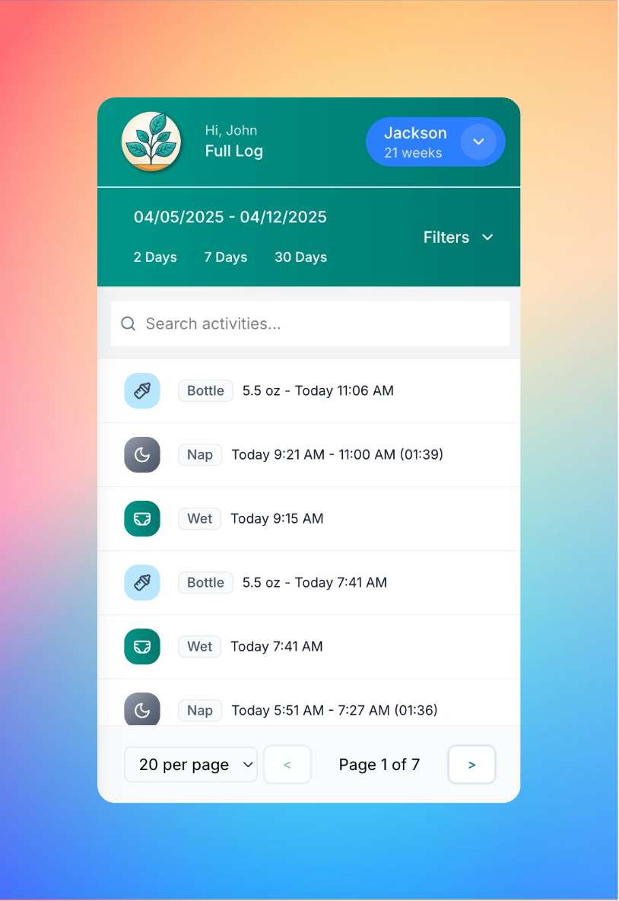
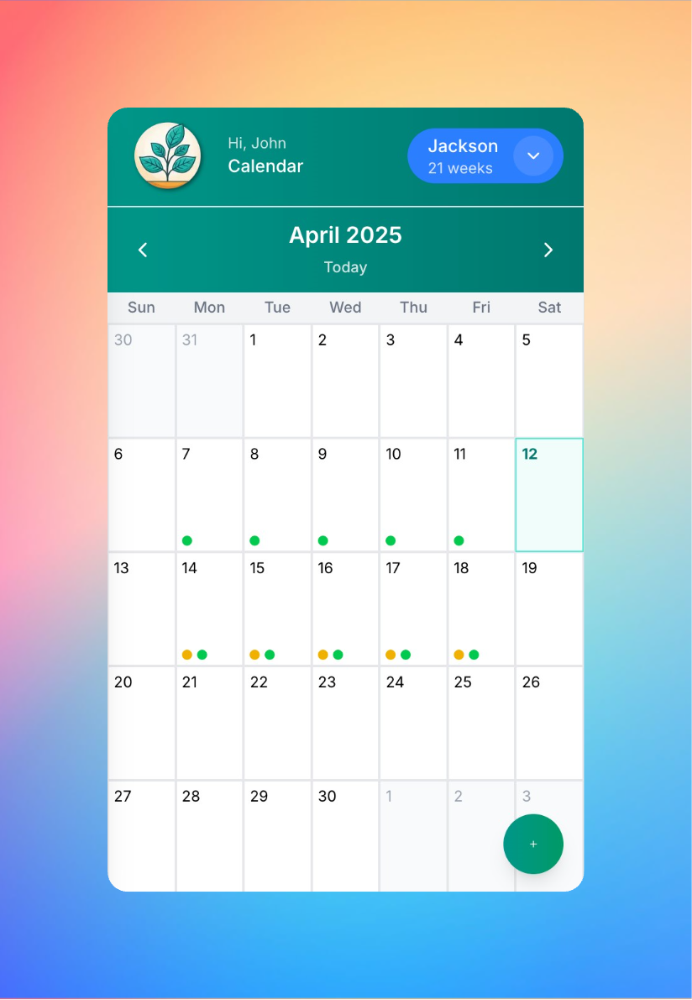
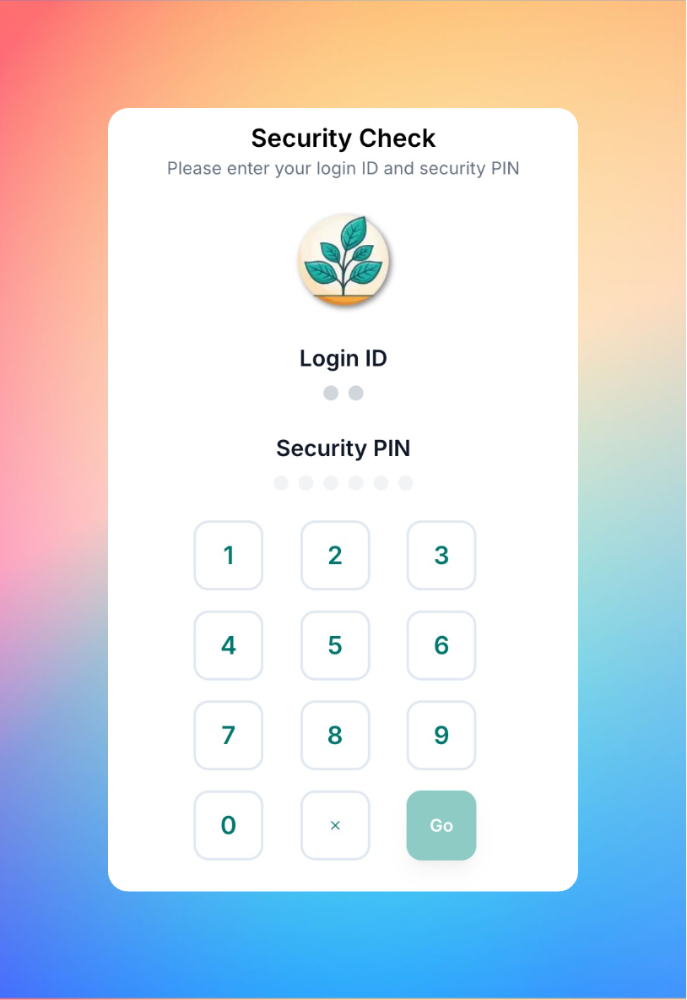
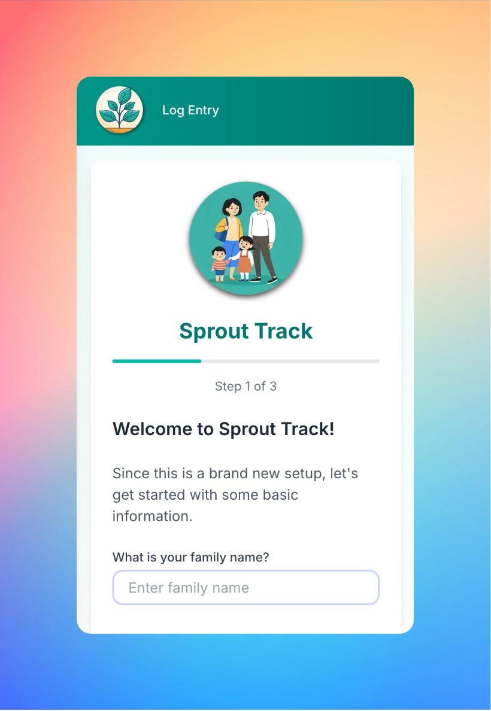

# Sprout Track

A Next.js application for tracking baby activities, milestones, and development.

## Screenshots

<table>
  <tr>
    <td width="33%"><br/><em>Mobile-first app for tracking your child's activities</em></td>
    <td width="33%"><br/><em>Dark mode for late night feedings</em></td>
    <td width="33%"><br/><em>Responsive design for larger devices</em></td>
  </tr>
  <tr>
    <td width="33%"><br/><em>Quick entry for logging activities</em></td>
    <td width="33%"><br/><em>Comprehensive searchable activity log</em></td>
    <td width="33%"><br/><em>Calendar for tracking events and reminders</em></td>
  </tr>
  <tr>
    <td width="33%"><br/><em>Secure login with IP-based lockout</em></td>
    <td width="33%"><br/><em>User-friendly setup wizard</em></td>
    <td width="33%"></td>
  </tr>
</table>

## Table of Contents

- [Tech Stack](#tech-stack)
- [Getting Started](#getting-started)
  - [Prerequisites](#prerequisites)
  - [Quick Setup (Recommended)](#quick-setup-recommended)
  - [Manual Setup (Alternative)](#manual-setup-alternative)
  - [Default Security PIN](#default-security-pin)
- [Initial Application Setup](#initial-application-setup)
  - [Setup Wizard](#setup-wizard)
- [Project Structure](#project-structure)
- [Available Scripts](#available-scripts)
  - [Next.js Server/Dev Scripts](#nextjs-serverdev-scripts)
  - [Customizing Port Numbers](#customizing-port-numbers)
  - [Database Scripts](#database-scripts)
  - [Utility Scripts](#utility-scripts)
  - [Updating the Application](#updating-the-application)
- [Environment Variables](#environment-variables)
- [Docker Deployment](#docker-deployment)
  - [Prerequisites](#prerequisites-1)
  - [Quick Docker Setup](#quick-docker-setup)
  - [Docker Management Commands](#docker-management-commands)
  - [Updating Docker Deployment](#updating-docker-deployment)
  - [Database Backups in Docker](#database-backups-in-docker)
  - [Data Persistence](#data-persistence)

## Tech Stack

- Next.js with App Router
- TypeScript
- Prisma with SQLite (`/prisma`)
- TailwindCSS for styling
- React Query for data fetching
- React Hook Form for form handling
- Docker for containerization (optional)

## Getting Started

### Prerequisites

- Git (to clone the repository)
- Node.js (v22+) and NPM (v10+)
- Bash shell (for running the setup script)

### Quick Setup (Recommended)

1. Clone the repository:
```bash
git clone https://github.com/Oak-and-Sprout/sprout-track.git
cd sprout-track
```

2. If deploying to a restricted directory (like /var/www), set proper permissions:
```bash
# For standard web server directories like /var/www
sudo chown -R $(whoami):$(whoami) .
# Or specify your web server user (e.g., www-data)
# sudo chown -R www-data:www-data .
```

3. Give execute permissions to the scripts folder:
```bash
chmod +x scripts/*.sh
```

4. Run the setup script:
```bash
./scripts/setup.sh
```

This setup script will:
- Install all dependencies
- Generate the Prisma client
- Run database migrations
- Seed the database with initial data (default PIN: 111222)
- Build the Next.js application

After setup completes, you can run the application in development or production mode as instructed in the setup output.

### Manual Setup (Alternative)

If you prefer to set up manually or the setup script doesn't work for your environment:

1. Ensure Node.js (v22+) and NPM (v10+) are installed

2. Install dependencies:
```bash
npm install
```

3. Generate Prisma client:
```bash
npm run prisma:generate
```

4. Run database migrations:
```bash
npm run prisma:migrate
```

5. Seed the database:
```bash
npm run prisma:seed
```
### To run the development server:
```bash
npm run dev
```

### To run the production server:
1. Build the application:
```bash
npm run build
```
2. Run the production server:
```bash
npm run start
```

Open [http://localhost:3000](http://localhost:3000) with your browser to see the result.

### Default Security PIN

The default security PIN after setup is: **111222**

## Initial Application Setup

After installation, when you first access the application, you'll be guided through a setup wizard that helps you configure the essential settings for your Sprout Track instance.

### Setup Wizard

The application includes a built-in Setup Wizard (`src/components/SetupWizard`) that walks you through the following steps:

1. **Family Setup**
   - Enter your family name

2. **Security Setup**
   - Choose between a system-wide PIN or individual caretaker PINs
   - For system-wide PIN: Set a 6-10 digit PIN
   - For individual caretakers: Add caretakers with their own login IDs and PINs
     - First caretaker must be an admin
     - Each caretaker needs a 2-character login ID and 6-10 digit PIN

3. **Baby Setup**
   - Enter baby's information (first name, last name, birth date, gender)
   - Configure warning times for feeding and diaper changes
   - Default warning times: Feed (2 hours), Diaper (3 hours)

The Setup Wizard ensures your application is properly configured with the necessary security settings and initial data before you start tracking your baby's activities.

## Project Structure

- `/app` - Next.js app router pages and components
- `/prisma` - SQLite database and Prisma schema
- `/src/components` - Reusable UI components
- `/src/lib` - Utility functions and shared logic
- `/scripts` - Utility scripts for setup, deployment, and maintenance

## Available Scripts

### Next.js Server/Dev Scripts

- `npm run dev` - Start development server
- `npm run build` - Build for production
- `npm start` - Start production server
- `npm run lint` - Run ESLint

### Customizing Port Numbers

By default, the application runs on port 3000. To change the port:

1. Open `package.json` in your preferred text editor
2. Locate the "scripts" section
3. Modify the "dev" and/or "start" scripts to include the `-p` flag followed by your desired port number:

```json
"scripts": {
  "dev": "next dev -p 4000",  // Development server will run on port 4000
  "start": "next start -p 8080"  // Production server will run on port 8080
}
```

This change will persist across application updates. For Docker deployments, use the PORT environment variable as described in the Docker section.

### Database Scripts

- `npm run prisma:generate` - Generate Prisma client
- `npm run prisma:migrate` - Run database migrations
- `npm run prisma:seed` - Seed the database with initial data
- `npm run prisma:studio` - Open Prisma Studio to view/edit database

### Utility Scripts

- `./scripts/setup.sh` - Complete setup process (Node.js check, dependencies, database, build)
- `./scripts/backup.sh` - Create a backup of the application and database
- `./scripts/update.sh` - Update application (git pull, prisma operations, build)
- `./scripts/deployment.sh` - Full deployment process (backup + update)
- `./scripts/service.sh {start|stop|restart|status}` - Manage the application service

### Updating the Application

For a full update/deployment process:
```bash
./scripts/deployment.sh
```

This will:
1. Create a backup of the current application
2. Pull latest changes from git
3. Run Prisma operations
4. Build the application
5. Manage service stop/start as needed

Each script can also be run independently for specific operations.

## Environment Variables

The application can be configured using environment variables in the `.env` file. Here are the available options:

| Variable | Description | Default | Example |
|----------|-------------|---------|---------|
| `DATABASE_URL` | Path to the SQLite database | `"file:../db/baby-tracker.db"` | `"file:/path/to/custom/db.sqlite"` |
| `SERVICE_NAME` | Name of the systemd service | `"baby-tracker"` | `"sprout-track"` |
| `AUTH_LIFE` | Authentication token validity period in seconds | `"86400"` (24 hours) | `"43200"` (12 hours) |
| `IDLE_TIME` | Idle timeout before automatic logout in seconds | `"28800"` (8 hours) | `"3600"` (1 hour) |
| `APP_VERSION` | Application version | `"0.9.0"` | `"1.0.0"` |
| `COOKIE_SECURE` | Whether cookies require HTTPS connections | `"false"` | `"true"` |

### Important Notes:

- **DATABASE_URL**: Changing this after initial setup requires migrating your data manually.
- **AUTH_LIFE**: Lower values increase security but require more frequent logins.
- **IDLE_TIME**: Determines how long a user can be inactive before being logged out.
- **COOKIE_SECURE**: 
  - Set to `"false"` to allow cookies on non-HTTPS connections (development or initial setup)
  - Set to `"true"` when you have an SSL certificate in place (recommended for production)
  - When set to `"true"`, the application will only work over HTTPS connections

## Docker Deployment

The application can be easily deployed using Docker. This method provides a consistent environment and simplifies the setup process.

### Prerequisites

- Docker and Docker Compose installed on your system
- Git to clone the repository

### Quick Docker Setup

1. Clone the repository:
```bash
git clone https://github.com/Oak-and-Sprout/sprout-track.git
cd sprout-track
```

2. Make the Docker setup script executable:
```bash
chmod +x scripts/docker-setup.sh
```

3. Build the Docker image:
```bash
./scripts/docker-setup.sh build
```

4. Start the application:
```bash
./scripts/docker-setup.sh start
```

The application will be available at http://localhost:3000 by default.

### Docker Management Commands

The `docker-setup.sh` script provides several commands to manage the Docker deployment:

- `./scripts/docker-setup.sh build` - Build the Docker image
- `./scripts/docker-setup.sh start` - Start the Docker containers
- `./scripts/docker-setup.sh stop` - Stop the Docker containers
- `./scripts/docker-setup.sh restart` - Restart the Docker containers
- `./scripts/docker-setup.sh update` - Update the container with latest code and run migrations
- `./scripts/docker-setup.sh backup` - Create a backup of the database volume
- `./scripts/docker-setup.sh logs` - View container logs
- `./scripts/docker-setup.sh status` - Check container status
- `./scripts/docker-setup.sh clean` - Remove containers, images, and volumes (caution: data loss)

You can customize the port by setting the PORT environment variable:
```bash
PORT=8080 ./scripts/docker-setup.sh start
```

### Updating Docker Deployment

To update your Docker deployment with the latest code and run any necessary database migrations:

```bash
./scripts/docker-setup.sh update
```

This command will:
1. Pull the latest code from git
2. Create a backup of your database
3. Rebuild the Docker image with the latest code
4. Stop and restart the container (which automatically runs migrations)

### Database Backups in Docker

You can create a backup of your database at any time with:

```bash
./scripts/docker-setup.sh backup
```

Backups are stored in the `backups` directory in your project folder with timestamps in the filename format `sprout-track-db-YYYYMMDD_HHMMSS.tar`.

### Data Persistence

The application data is stored in a Docker volume named `sprout-track-db`. This ensures that your data persists even if the container is removed or rebuilt.
