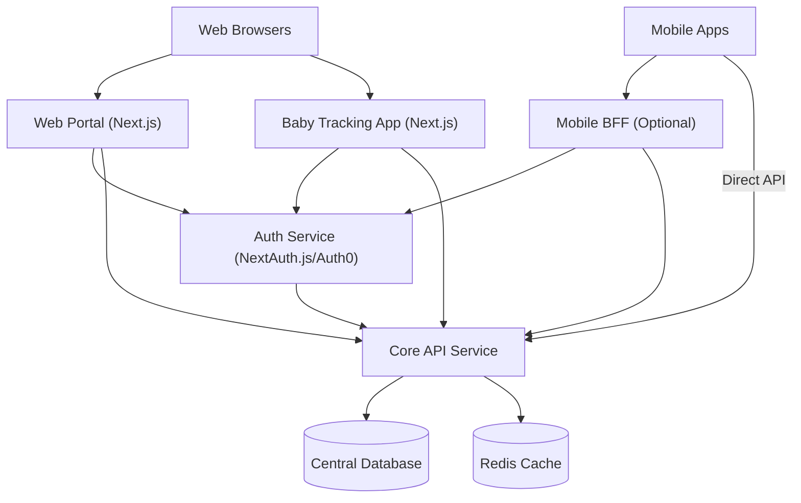

```mermaid
graph TD
    Browser["Web Browsers"] --> WebPortal["Web Portal (Next.js)"]
    Browser --> BabyApp["Baby Tracking App (Next.js)"]
    MobileApps["Mobile Apps"] --> MobileBFF["Mobile BFF (Optional)"]
    MobileApps -->|Direct API| CoreAPI
    
    WebPortal --> AuthService["Auth Service (NextAuth.js/Auth0)"]
    BabyApp --> AuthService
    MobileBFF --> AuthService
    
    WebPortal --> CoreAPI["Core API Service"]
    BabyApp --> CoreAPI
    MobileBFF --> CoreAPI
    
    AuthService --> CoreAPI
    CoreAPI --> DB[(Central Database)]
    CoreAPI --> Cache[(Redis Cache)]
```