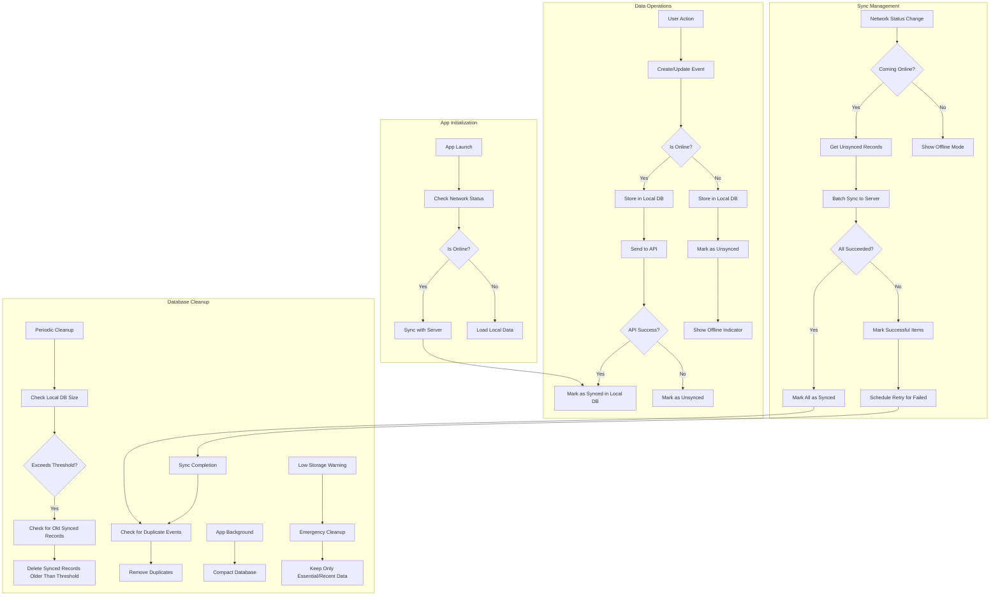

# TypeScript of Offline Support

```typescript
// 1. LOCAL DATABASE SETUP (using Realm or WatermelonDB)
// File: src/database/schema.js
import { Database } from '@nozbe/watermelondb';
import SQLiteAdapter from '@nozbe/watermelondb/adapters/sqlite';
import { appSchema, tableSchema } from '@nozbe/watermelondb/Schema';

// Define your schema
const schema = appSchema({
  version: 1,
  tables: [
    tableSchema({
      name: 'baby_events',
      columns: [
        { name: 'baby_id', type: 'string', isIndexed: true },
        { name: 'event_type', type: 'string', isIndexed: true },
        { name: 'timestamp', type: 'number', isIndexed: true },
        { name: 'event_data', type: 'string' }, // Serialized JSON
        { name: 'is_synced', type: 'boolean', isIndexed: true },
        { name: 'server_id', type: 'string', isOptional: true }, // ID from server
        { name: 'created_at', type: 'number' },
        { name: 'updated_at', type: 'number' }
      ]
    }),
    tableSchema({
      name: 'babies',
      columns: [
        { name: 'name', type: 'string' },
        { name: 'birth_date', type: 'number' },
        { name: 'gender', type: 'string' },
        { name: 'picture_path', type: 'string', isOptional: true },
        { name: 'is_synced', type: 'boolean', isIndexed: true },
        { name: 'server_id', type: 'string', isOptional: true },
        { name: 'created_at', type: 'number' },
        { name: 'updated_at', type: 'number' }
      ]
    })
  ]
});

// Create database connection
const adapter = new SQLiteAdapter({
  schema,
  // Optional migrations
  migrations: [],
  // Set up database name
  dbName: 'babyTracker',
  // Logging for development
  useWebWorker: false,
  useIncrementalIndexedDB: true
});

export const database = new Database({
  adapter,
  modelClasses: [
    // We'll define these later
  ]
});

// 2. MODELS (using WatermelonDB)
// File: src/database/models/BabyEvent.js
import { Model } from '@nozbe/watermelondb';
import { field, date, children, readonly, text, json } from '@nozbe/watermelondb/decorators';

export default class BabyEvent extends Model {
  static table = 'baby_events';

  @text('baby_id') babyId;
  @text('event_type') eventType;
  @date('timestamp') timestamp;
  @json('event_data') eventData;
  @field('is_synced') isSynced;
  @text('server_id') serverId;
  @readonly @date('created_at') createdAt;
  @readonly @date('updated_at') updatedAt;
}

// 3. NETWORK STATUS MONITORING
// File: src/utils/NetworkManager.js
import NetInfo from '@react-native-community/netinfo';
import { syncUnsynced } from './SyncManager';

class NetworkManager {
  constructor() {
    this.isOnline = false;
    this.listeners = [];
    this.unsubscribe = null;
  }

  init() {
    // Start listening for network changes
    this.unsubscribe = NetInfo.addEventListener(state => {
      const wasOnline = this.isOnline;
      this.isOnline = state.isConnected && state.isInternetReachable;
      
      // Notify listeners
      this.listeners.forEach(listener => listener(this.isOnline));
      
      // If we just came online, trigger sync
      if (!wasOnline && this.isOnline) {
        console.log('Device came online, starting sync...');
        syncUnsynced();
      }
    });
    
    // Initial check
    NetInfo.fetch().then(state => {
      this.isOnline = state.isConnected && state.isInternetReachable;
    });
  }
  
  addListener(listener) {
    this.listeners.push(listener);
    return () => {
      this.listeners = this.listeners.filter(l => l !== listener);
    };
  }
  
  cleanup() {
    if (this.unsubscribe) {
      this.unsubscribe();
    }
  }
  
  isConnected() {
    return this.isOnline;
  }
}

export const networkManager = new NetworkManager();

// 4. SYNC MANAGER
// File: src/utils/SyncManager.js
import { database } from '../database/schema';
import { networkManager } from './NetworkManager';
import api from '../api';

// Store failed sync attempts to implement exponential backoff
const syncAttempts = new Map();

// Sync all unsynced records
export const syncUnsynced = async () => {
  if (!networkManager.isConnected()) {
    console.log('Cannot sync - device is offline');
    return { success: false, reason: 'offline' };
  }
  
  try {
    // Get all unsynced baby events
    const babyEventCollection = database.get('baby_events');
    const unsyncedEvents = await babyEventCollection
      .query(Q.where('is_synced', false))
      .fetch();
    
    console.log(`Found ${unsyncedEvents.length} unsynced events`);
    
    if (unsyncedEvents.length === 0) {
      return { success: true, synced: 0 };
    }
    
    // Group by baby for efficient batch processing
    const eventsByBaby = {};
    unsyncedEvents.forEach(event => {
      const babyId = event.babyId;
      if (!eventsByBaby[babyId]) {
        eventsByBaby[babyId] = [];
      }
      eventsByBaby[babyId].push(event);
    });
    
    // Sync each baby's events
    const results = [];
    
    await database.action(async () => {
      for (const [babyId, events] of Object.entries(eventsByBaby)) {
        try {
          // Create a batch of events to sync
          const eventBatch = events.map(event => ({
            local_id: event.id,
            event_type: event.eventType,
            timestamp: event.timestamp,
            event_data: event.eventData,
            server_id: event.serverId
          }));
          
          // Send to server
          const response = await api.syncEvents(babyId, eventBatch);
          
          // Update local records with server IDs
          for (const serverEvent of response.events) {
            const localEvent = events.find(e => e.id === serverEvent.local_id);
            if (localEvent) {
              await localEvent.update(record => {
                record.serverId = serverEvent.id;
                record.isSynced = true;
              });
              
              // Reset sync attempts if this event had previous failures
              if (syncAttempts.has(localEvent.id)) {
                syncAttempts.delete(localEvent.id);
              }
              
              results.push({
                id: localEvent.id,
                status: 'success',
                serverId: serverEvent.id
              });
            }
          }
        } catch (error) {
          console.error(`Failed to sync events for baby ${babyId}:`, error);
          
          // Mark individual events as failed
          for (const event of events) {
            // Track failure for backoff
            const attempts = syncAttempts.get(event.id) || 0;
            syncAttempts.set(event.id, attempts + 1);
            
            results.push({
              id: event.id,
              status: 'error',
              error: error.message,
              attempts: attempts + 1
            });
          }
        }
      }
    });
    
    return {
      success: true,
      total: unsyncedEvents.length,
      results
    };
  } catch (error) {
    console.error('Sync error:', error);
    return {
      success: false,
      error: error.message
    };
  }
};

// Schedule retries with exponential backoff
export const scheduleRetries = () => {
  // Clear any existing timers
  if (this.retryTimer) {
    clearTimeout(this.retryTimer);
  }
  
  // If we have failed attempts, schedule retry
  if (syncAttempts.size > 0) {
    // Find the lowest retry count to prioritize newer failures
    const minAttempts = Math.min(...Array.from(syncAttempts.values()));
    
    // Calculate backoff time (2^attempts seconds, max 1 hour)
    const backoffSeconds = Math.min(Math.pow(2, minAttempts), 3600);
    console.log(`Scheduling retry in ${backoffSeconds} seconds`);
    
    this.retryTimer = setTimeout(() => {
      if (networkManager.isConnected()) {
        syncUnsynced();
      } else {
        // Reschedule again if offline
        scheduleRetries();
      }
    }, backoffSeconds * 1000);
  }
};

// 5. DATABASE CLEANUP MANAGER
// File: src/utils/DatabaseCleanupManager.js
import { database } from '../database/schema';
import AsyncStorage from '@react-native-async-storage/async-storage';

// Constants for cleanup thresholds
const MAX_DB_SIZE_BYTES = 50 * 1024 * 1024; // 50MB
const SYNCED_DATA_RETENTION_DAYS = 30; // Keep synced data for 30 days
const EMERGENCY_RETENTION_DAYS = 7; // Emergency cleanup keeps only last 7 days
const CLEANUP_INTERVAL_MS = 24 * 60 * 60 * 1000; // Run cleanup once a day

class DatabaseCleanupManager {
  constructor() {
    this.cleanupTimer = null;
    this.lastCleanupTime = 0;
  }
  
  async init() {
    // Load last cleanup time
    try {
      const lastCleanup = await AsyncStorage.getItem('lastDatabaseCleanup');
      if (lastCleanup) {
        this.lastCleanupTime = parseInt(lastCleanup, 10);
      }
    } catch (error) {
      console.error('Failed to load cleanup time:', error);
    }
    
    // Schedule regular cleanup
    this.scheduleCleanup();
  }
  
  scheduleCleanup() {
    if (this.cleanupTimer) {
      clearTimeout(this.cleanupTimer);
    }
    
    const now = Date.now();
    const timeSinceLastCleanup = now - this.lastCleanupTime;
    
    if (timeSinceLastCleanup >= CLEANUP_INTERVAL_MS) {
      // Run cleanup now
      this.performCleanup();
    } else {
      // Schedule for the future
      const timeUntilNextCleanup = CLEANUP_INTERVAL_MS - timeSinceLastCleanup;
      this.cleanupTimer = setTimeout(() => {
        this.performCleanup();
      }, timeUntilNextCleanup);
    }
  }
  
  async performCleanup() {
    console.log('Starting database cleanup...');
    
    try {
      // Check database size first (if possible)
      const databaseSize = await this.getDatabaseSize();
      const emergencyMode = databaseSize > MAX_DB_SIZE_BYTES;
      
      await database.action(async () => {
        // 1. Remove old synced events
        const cutoffDate = new Date();
        cutoffDate.setDate(
          cutoffDate.getDate() - (emergencyMode ? EMERGENCY_RETENTION_DAYS : SYNCED_DATA_RETENTION_DAYS)
        );
        const cutoffTimestamp = cutoffDate.getTime();
        
        const eventsCollection = database.get('baby_events');
        
        let query = Q.where('is_synced', true);
        query = Q.and(query, Q.where('timestamp', Q.lt(cutoffTimestamp)));
        
        const oldSyncedEvents = await eventsCollection.query(query).fetch();
        console.log(`Found ${oldSyncedEvents.length} old synced events to clean up`);
        
        // Delete in batches to avoid UI freezing
        const batchSize = 100;
        for (let i = 0; i < oldSyncedEvents.length; i += batchSize) {
          const batch = oldSyncedEvents.slice(i, i + batchSize);
          for (const event of batch) {
            await event.destroyPermanently();
          }
        }
        
        // 2. Remove duplicates (events with same server_id)
        const allEvents = await eventsCollection.query().fetch();
        const serverIdMap = new Map();
        const duplicates = [];
        
        for (const event of allEvents) {
          if (event.serverId) {
            if (serverIdMap.has(event.serverId)) {
              // Keep newer one, mark older for deletion
              const existing = serverIdMap.get(event.serverId);
              if (event.updatedAt > existing.updatedAt) {
                duplicates.push(existing);
                serverIdMap.set(event.serverId, event);
              } else {
                duplicates.push(event);
              }
            } else {
              serverIdMap.set(event.serverId, event);
            }
          }
        }
        
        console.log(`Found ${duplicates.length} duplicate events to clean up`);
        for (const event of duplicates) {
          await event.destroyPermanently();
        }
      });
      
      // 3. Compact database (implementation depends on specific DB)
      await this.compactDatabase();
      
      // Update last cleanup time
      this.lastCleanupTime = Date.now();
      await AsyncStorage.setItem('lastDatabaseCleanup', this.lastCleanupTime.toString());
      
      console.log('Database cleanup completed successfully');
    } catch (error) {
      console.error('Database cleanup failed:', error);
    }
    
    // Schedule next cleanup
    this.scheduleCleanup();
  }
  
  async getDatabaseSize() {
    // This is a placeholder - actual implementation depends on
    // the database and platform (iOS/Android)
    // For WatermelonDB, you might need native modules to check file size
    return 0; // Return placeholder size for now
  }
  
  async compactDatabase() {
    // Database compaction implementation
    // For WatermelonDB, consider using `database.localStorage.unsafeExecute`
    console.log('Database compaction performed');
  }
  
  // Run emergency cleanup when device is low on storage
  async performEmergencyCleanup() {
    console.log('Performing emergency database cleanup');
    
    // Set emergency mode
    const emergencyMode = true;
    
    // Use the same cleanup routine but with stricter thresholds
    await this.performCleanup(emergencyMode);
  }
}

export const databaseCleanup = new DatabaseCleanupManager();

// 6. DATA SERVICE - Integration point for components
// File: src/services/BabyEventService.js
import { database } from '../database/schema';
import { networkManager } from '../utils/NetworkManager';
import { syncUnsynced } from '../utils/SyncManager';

class BabyEventService {
  // Add a new baby event
  async addEvent(babyId, eventType, eventData) {
    const timestamp = Date.now();
    const isOnline = networkManager.isConnected();
    
    try {
      // First add to local database
      const eventRecord = await database.action(async () => {
        const eventsCollection = database.get('baby_events');
        
        const newEvent = await eventsCollection.create(event => {
          event.babyId = babyId;
          event.eventType = eventType;
          event.timestamp = timestamp;
          event.eventData = eventData;
          event.isSynced = false; // Assume not synced initially
        });
        
        return newEvent;
      });
      
      // If online, try to sync immediately
      if (isOnline) {
        // Here we could directly push to API, but using the sync manager keeps code consistent
        syncUnsynced();
      }
      
      return {
        success: true,
        event: eventRecord,
        isOnline
      };
    } catch (error) {
      console.error('Failed to add event:', error);
      return {
        success: false,
        error: error.message
      };
    }
  }
  
  // Get events for a baby
  async getEvents(babyId, options = {}) {
    try {
      const eventsCollection = database.get('baby_events');
      
      let query = Q.where('baby_id', babyId);
      
      // Add filters for event type if provided
      if (options.eventType) {
        query = Q.and(query, Q.where('event_type', options.eventType));
      }
      
      // Add date range filters if provided
      if (options.startDate) {
        query = Q.and(query, Q.where('timestamp', Q.gte(options.startDate)));
      }
      
      if (options.endDate) {
        query = Q.and(query, Q.where('timestamp', Q.lte(options.endDate)));
      }
      
      // Sort by timestamp, newest first by default
      const sortOrder = options.sortAsc ? Q.asc : Q.desc;
      query = Q.and(query, Q.sortBy('timestamp', sortOrder));
      
      // Add limit if specified
      if (options.limit) {
        query = Q.and(query, Q.take(options.limit));
      }
      
      const events = await eventsCollection.query(query).fetch();
      
      return {
        success: true,
        events,
        isOnline: networkManager.isConnected()
      };
    } catch (error) {
      console.error('Failed to get events:', error);
      return {
        success: false,
        error: error.message
      };
    }
  }
  
  // Delete an event
  async deleteEvent(eventId) {
    try {
      await database.action(async () => {
        const eventsCollection = database.get('baby_events');
        const event = await eventsCollection.find(eventId);
        
        if (event) {
          // If it's already synced, we need to mark it for deletion on server
          if (event.isSynced && event.serverId) {
            // Approach 1: Use soft delete flag
            await event.update(record => {
              record.eventData = {
                ...record.eventData,
                _deleted: true
              };
              record.isSynced = false; // Mark for sync
            });
          } else {
            // Not synced yet, can safely delete locally
            await event.destroyPermanently();
          }
        }
      });
      
      // If online, sync the deletion
      if (networkManager.isConnected()) {
        syncUnsynced();
      }
      
      return { success: true };
    } catch (error) {
      console.error('Failed to delete event:', error);
      return {
        success: false,
        error: error.message
      };
    }
  }
  
  // Get sync status summary
  async getSyncStatus() {
    try {
      const eventsCollection = database.get('baby_events');
      
      const unsyncedCount = await eventsCollection
        .query(Q.where('is_synced', false))
        .fetchCount();
      
      return {
        pendingSync: unsyncedCount,
        isOnline: networkManager.isConnected()
      };
    } catch (error) {
      console.error('Failed to get sync status:', error);
      return {
        error: error.message
      };
    }
  }
}

export const babyEventService = new BabyEventService();
```